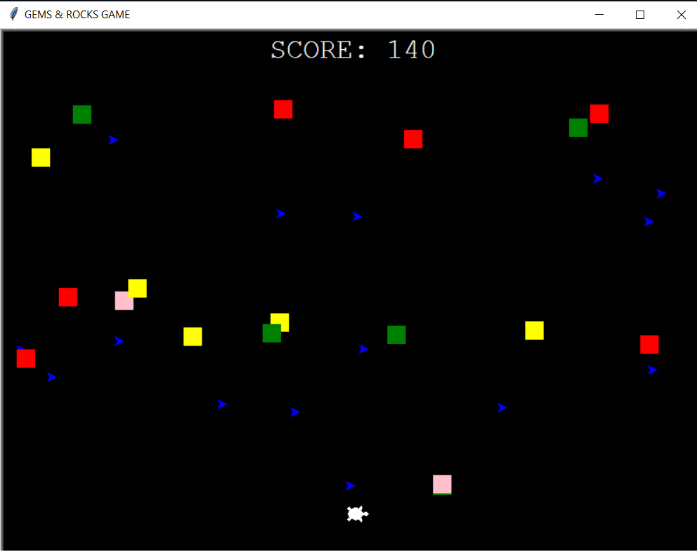

# **WEEK 4 ACTIVITY**
## GEMS & ROCKS GAME

> **ABOUT THE GAME**

> The Greed Game is a catching type game, where the player(turtle) must catch the GEMS(arrows). For every GEMS is worth 10 points, but catching rocks(SQUARES) will deduct 10 points in the game.

> 1. Run the python program named "GREED_WEEK4.py"
> 2. A mini window will appear
> 3. Exit the window to quit the game
